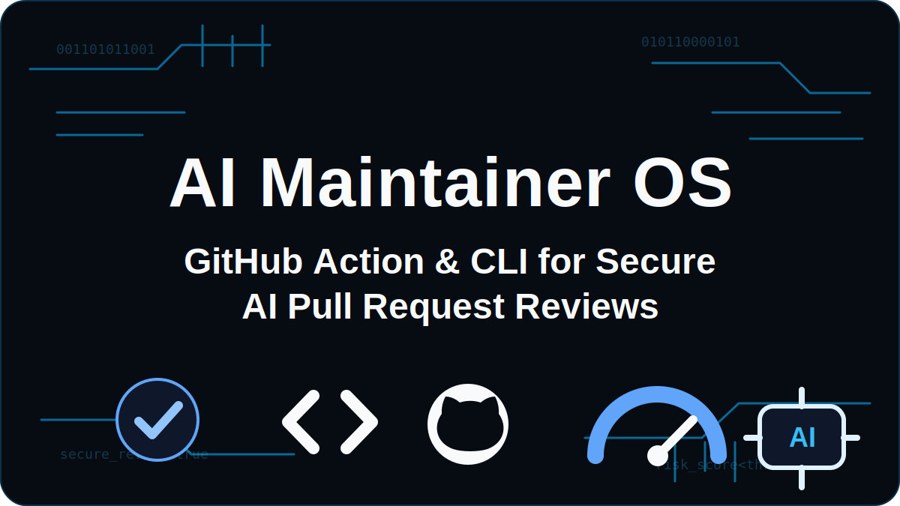

# AI Maintainer OS

> GitHub Action and CLI for reviewing AI-assisted pull requests with deterministic risk scoring, evidence, and maintainer-ready reports.

[](https://github.com/P-r-e-m-i-u-m/ai-maintainer-os/actions/workflows/ci.yml)



AI coding agents can move fast, but maintainers still carry the risk. AI Maintainer OS gives teams a practical review layer for pull requests that may contain generated code, hidden security risk, missing tests, workflow edits, or dependency changes.

It does not try to replace human review. It gives maintainers a clear first pass:

- what changed
- why it is risky
- which files need attention
- what evidence is missing
- whether CI should block the PR

## What It Checks

- Secret-like values added in diffs
- Security-sensitive paths
- GitHub Actions workflow edits
- Dependency manifest changes
- Missing tests for source changes
- Large hard-to-review PRs
- Thin PR descriptions with weak review context
- Missing test evidence, risk notes, or linked issue/design context
- Suspicious dependency versions such as `latest`

## Why Maintainers Need This

AI-generated pull requests are becoming normal. The hard part is no longer only writing code; it is deciding what is safe to merge.

AI Maintainer OS helps maintainers answer:

- Does this PR touch risky files?
- Did it change production code without tests?
- Did it add secrets or suspicious dependencies?
- Does the PR description explain intent and verification?
- Should this be blocked until a human reviews it?

## Quick Start

```bash
npm install
npm run check
npm run demo
```

Run against a diff:

```bash
npm run build
node dist/src/cli.js scan --diff examples/sample-pr.diff --format markdown
```

## GitHub Action Usage

Add `.github/workflows/ai-maintainer-os.yml`:

```yaml
name: AI Maintainer OS

on:
  pull_request:
    types: [opened, synchronize, reopened, edited]

permissions:
  contents: read
  pull-requests: read
  issues: write

jobs:
  review:
    runs-on: ubuntu-latest
    steps:
      - uses: actions/checkout@v5
        with:
          fetch-depth: 0

      - uses: P-r-e-m-i-u-m/ai-maintainer-os@v0.1.0
        with:
          fail-on: high
          comment: "true"
```


## Monorepo Example

For monorepos, start with a stricter threshold on packages that own authentication, payments, deployment, or shared runtime code. Keep the workflow copy-paste friendly, then document the package-specific review expectations for maintainers.

```yaml
name: AI Maintainer OS

on:
  pull_request:
    types: [opened, synchronize, reopened, edited]

permissions:
  contents: read
  pull-requests: read
  issues: write

jobs:
  review:
    runs-on: ubuntu-latest
    steps:
      - uses: actions/checkout@v5
        with:
          fetch-depth: 0

      - uses: P-r-e-m-i-u-m/ai-maintainer-os@v0.1.0
        with:
          fail-on: medium
          comment: "true"
```

Suggested monorepo review expectations:

- Treat `apps/web/src/auth/**`, `apps/api/src/billing/**`, `packages/db/**`, and `.github/workflows/**` as sensitive package paths.
- Expect tests near the changed package, such as `apps/web/__tests__/**`, `apps/api/tests/**`, or `packages/*/tests/**`.
- Use `fail-on: medium` for security-sensitive packages and shared infrastructure.
- Use `fail-on: high` for general application packages where maintainers want fewer blocking checks.
- Use `fail-on: critical` for experimental packages where the report should inform review but rarely block CI.

## Example Output

```md
## AI Maintainer OS Review

Risk: [CRITICAL] CRITICAL
Score: 100/100
Summary: Critical review risk detected. Do not merge until resolved.

Required Actions
- Remove the value, rotate the secret if it was real, and use environment or secret storage.
- Review permissions, token use, third-party actions, and whether the change can run on forks.
```

## Design Principles

- Deterministic first, LLM optional later
- Human-readable evidence over vague scores
- Maintainer judgment stays in control
- Safe by default for public open source
- No prompt or code upload to third-party services

## Roadmap

- SARIF output for GitHub code scanning
- Config file support
- Contributor trust history
- LLM-assisted review summaries with local redaction
- Dependency provenance checks
- Maintainer dashboard for risky PR trends

## Documentation

- [Architecture](docs/ARCHITECTURE.md)
- [Policy model](docs/POLICY.md)
- [Maintainer playbook](docs/MAINTAINER_PLAYBOOK.md)
- [AI PR review standard](docs/AI_PR_REVIEW_STANDARD.md)
- [Research notes](docs/RESEARCH_NOTES.md)

## License

MIT
